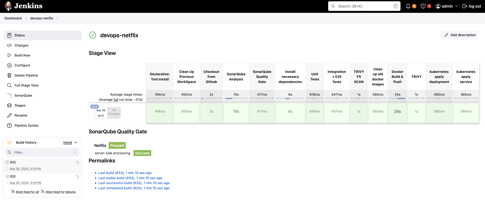
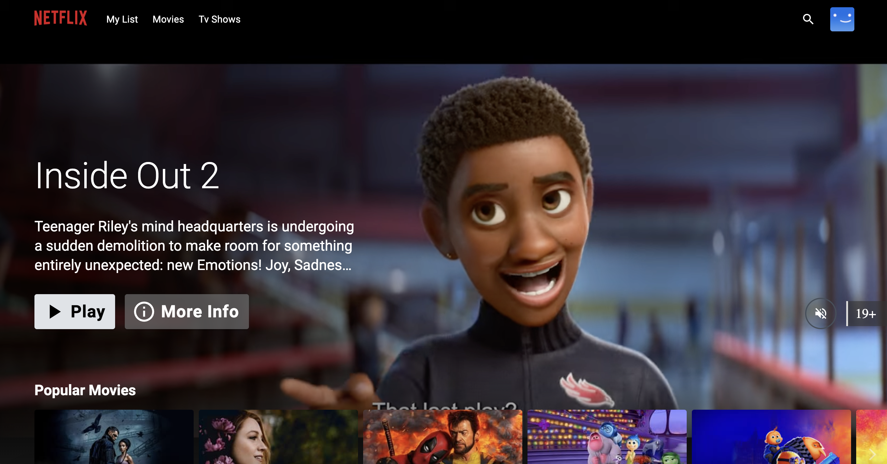

# 
DevSecOps  Application

This project is developed using DevSecOps approaches to run a demo Netflix application in a Kubernetes environment. The project integrates various tools such as SonarQube, Grafana, Prometheus, Docker Hub, and others to implement security, monitoring, and continuous integration processes.

## Features
- **Deployment with Kubernetes:** The application is configured to run on Kubernetes.
- **Continuous Integration:** Automated testing and deployment processes are carried out using Jenkins.
- **Code Quality Analysis:** SonarQube is used to analyze code quality and detect security vulnerabilities.
- **Performance Monitoring:** Prometheus and Grafana are used to monitor the performance of the application.
- **Security Scanning:** Trivy is used for image security scanning.

